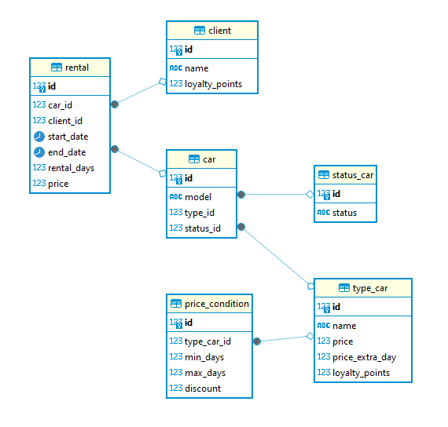
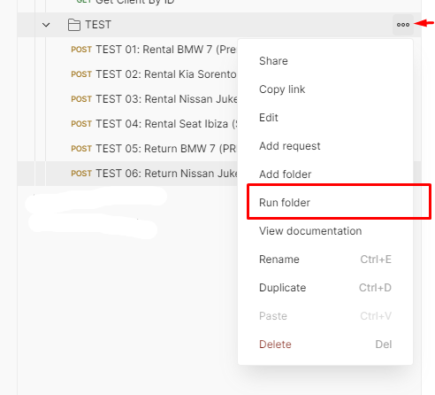

# RENTAL CAR SYSTEM

Este microservicio de gestión de alquileres de coches está diseñado para administrar el alquiler de coches según su categoría. A continuación, se describen los requisitos para desplegar la aplicación, una breve explicación de cada endpoint y cómo acceder a la documentación de la API a través de Swagger.

## Requisitos para desplegar la Aplicación

Para desplegar y ejecutar esta aplicación, debes tener instalado lo siguiente:

- Java Development Kit (JDK) 22 o superior
- Maven
- Docker (De ser necesario).
- Postman (Para realizar las pruebas integradas)

## Docker

El microservicio se ha creado de tal manera que puedas levantarlo en docker mediante **compose-up.bat** que se encuentra en la raiz del proyecto. Este archivo solo ejecuta el **docker compose up -d --build** para crear el contenedor. Para esto se requiere tener instalado Docker Compose en la máquina donde se desea desplegar el contenedor.

## Levantar la Aplicación

Para levantar la app puedes hacerlo por Docker (paso explicado en el apartado anterior), desde un IDE (Ej: Intellij IDEA), o también puedes construir el .jar de la app con Maven y ejecutarla con Java usando el comando **java -jar target/[rental-1.0.0-SNAPSHOT.jar](target%2Frental-1.0.0-SNAPSHOT.jar)**

## Documentación de la API (Swagger)

Puedes acceder a la documentación detallada de la API utilizando Swagger. Sigue estos pasos:

1. Inicia la aplicación en tu entorno de desarrollo.
2. Abre un navegador web y ve a la siguiente URL: [http://localhost:8081/swagger-ui.html#/](http://localhost:8081/swagger-ui.html#/)
3. Desde la interfaz de Swagger, podrás explorar y probar todos los endpoints disponibles en la API. También encontrarás descripciones detalladas de cada endpoint y los datos de solicitud y respuesta esperados.

## Endpoints de la API

El microservicio proporciona los siguientes endpoints de la API para gestionar alquileres de coches:

**Base URL**: http://localhost:8081

### Car Operations: Operaciones relacionadas con el inventario de coches.

#### Get Car by ID

- **URL**: `/api/v1/cars/{id}`
- **Método**: `GET`
- **Descripción**: Obtener coche por ID.
- **Parámetros**:
    - `id` (path, integer, required): El ID del coche.
- **Respuestas**:
    - `200`: Coche obtenido con éxito.
        - **Contenido**: `application/json`
        - **Esquema**: `CarDTO`
    - `400`: Solicitud incorrecta.
        - **Esquema**: `ErrorDto`
    - `404`: Recursos no encontrados.
    - `500`: Error interno del servidor.

#### Update a Car

- **URL**: `/api/v1/cars/{id}`
- **Método**: `PUT`
- **Descripción**: Actualizar un coche proporcionando el ID del coche, el modelo del coche, el ID del tipo y el ID del estado.
- **Parámetros**:
    - `id` (path, integer, required): El ID del coche.
- **Cuerpo de la Solicitud**:
    - **Contenido**: `application/json`
    - **Esquema**: `CarDTO`
- **Respuestas**:
    - `200`: Coche actualizado con éxito.
    - `400`: Entrada inválida.
    - `404`: Recursos no encontrados.
    - `500`: Error interno del servidor.

#### Delete a Car

- **URL**: `/api/v1/cars/{id}`
- **Método**: `DELETE`
- **Descripción**: Eliminar un coche proporcionando el ID del coche.
- **Parámetros**:
    - `id` (path, integer, required): El ID del coche.
- **Respuestas**:
    - `204`: Coche eliminado con éxito.
    - `400`: Entrada inválida.
    - `404`: Recursos no encontrados.
    - `500`: Error interno del servidor.

#### Get all Cars

- **URL**: `/api/v1/cars`
- **Método**: `GET`
- **Descripción**: Obtener todos los coches con paginación.
- **Parámetros**:
    - `page` (query, object, required): Parámetros de paginación.
        - **Esquema**: `Pageable`
- **Respuestas**:
    - `200`: Coche(s) obtenido(s) con éxito.
        - **Contenido**: `application/json`
        - **Esquema**: `CarDTO`
    - `400`: Entrada inválida.
    - `404`: Recursos no encontrados.
    - `500`: Error interno del servidor.

#### Create a Car

- **URL**: `/api/v1/cars`
- **Método**: `POST`
- **Descripción**: Crear un coche proporcionando el modelo del coche, el ID del tipo y el ID del estado.
- **Cuerpo de la Solicitud**:
    - **Contenido**: `application/json`
    - **Esquema**: `CarDTO`
- **Respuestas**:
    - `200`: Coche creado con éxito.
    - `400`: Entrada inválida.
    - `404`: No encontrado.
        - **Esquema**: `ErrorDto`
    - `500`: Error interno del servidor.

### Rental Operations: Operaciones relacionadas con el alquiler y la devolución del coche.

#### Rent a Car

- **URL**: `/api/v1/rentals/rent`
- **Método**: `POST`
- **Descripción**: Alquilar un coche proporcionando el ID del coche, el ID del cliente y los días de alquiler.
- **Cuerpo de la Solicitud**:
    - **Contenido**: `application/json`
    - **Esquema**: `RentalRequestDTO`
- **Respuestas**:
    - `200`: Coche alquilado con éxito.
        - **Contenido**: `application/json`
        - **Esquema**: `RentalDTO`
    - `400`: Entrada inválida.
    - `404`: Recursos no encontrados.
    - `500`: Error interno del servidor.

#### Return a Car

- **URL**: `/api/v1/rentals/return`
- **Método**: `POST`
- **Descripción**: Devolver un coche proporcionando el ID del alquiler y la fecha de devolución.
- **Cuerpo de la Solicitud**:
    - **Contenido**: `application/json`
    - **Esquema**: `ReturnRequestDTO`
- **Respuestas**:
    - `200`: Coche devuelto con éxito.
        - **Contenido**: `*/*`
        - **Esquema**: `ReturnResponseDTO`
    - `400`: Entrada inválida.
    - `404`: Recursos no encontrados.
    - `500`: Error interno del servidor.

### Client Operations: Operaciones relacionadas con los clientes.

#### Get all Clients

- **URL**: `/api/v1/clients`
- **Método**: `GET`
- **Descripción**: Obtener todos los clientes con paginación.
- **Parámetros**:
    - `page` (query, object, required): Parámetros de paginación.
        - **Esquema**: `Pageable`
- **Respuestas**:
    - `200`: Clientes obtenidos con éxito.
        - **Contenido**: `application/json`
        - **Esquema**: `ClientDTO`
    - `400`: Entrada inválida.
    - `404`: Recursos no encontrados.
    - `500`: Error interno del servidor.

#### Get Client by ID

- **URL**: `/api/v1/clients/{id}`
- **Método**: `GET`
- **Descripción**: Obtener cliente por ID.
- **Parámetros**:
    - `id` (path, integer, required): El ID del cliente.
- **Respuestas**:
    - `200`: Cliente obtenido con éxito.
        - **Contenido**: `application/json`
        - **Esquema**: `ClientDTO`
    - `400`: Solicitud incorrecta.
        - **Esquema**: `ErrorDto`
    - `404`: Recursos no encontrados.
    - `500`: Error interno del servidor.

Cada endpoint espera y devuelve datos en formato JSON. Asegúrate de proporcionar los datos necesarios en el cuerpo de la solicitud en el formato correcto.

## Bases de Datos

Para este proyecto se ha utilizado una base de datos H2 en memoria. La base de datos se inicializa con datos de prueba al iniciar la aplicación. Puedes acceder a la consola de H2 para consultar y administrar la base de datos en la siguiente URL: [http://localhost:8081/h2-console](http://localhost:8081/h2-console)

Para dar solución a los requerimientos de la aplicación, se han creado las siguientes tablas:

- **rental**: Tabla que almacena la información de los alquileres de coches.
- **car**: Tabla que almacena la información de los coches disponibles en el inventario.
- **client**: Tabla que almacena la información de los clientes.
- **status_car**: Tabla que almacena la información de los estados de los coches.
- **type_car**: Tabla que almacena la información de los tipos de coches.
- **price_condition**: Tabla que almacena las condiciones de precio para el alquiler de coches según su tipo, el rango de días en el que se aplica y su descuento.

**Nota: Dentro de la carpeta ./resources se encuentra el archivo data.sql que contiene el script inicial de carga de datos.**

## Pruebas Integradas

Se adjunta dentro de la carpeta **/postman** que se encuentra en la raíz del proyecto, se encuentran las collections de Postman que se podrá importar para realizar las pruebas de los puntos a continuación:

1. Métodos para manejar el inventario de coches CRUD.(Dentro de la subcaprteta **/Car API**). 
    - En este punto he me enfoqué en exponer los métodos de creación, actualización, eliminación y consulta de coches.
2. Lógica para calcular el precio del alquiler en flujo de alquiler de coches.(Dentro de la subcaprteta **/Rental API**).
    - Para este caso he creado un método destinado al alquiler de coches, donde se calcula el precio del alquiler según la categoría del coche, tomando en consideración los distintos rangos de precio según los días de alquiler. Las condiciones para los precios son cargados al inicio en bbdd por lo que son perfectamente configurables.
3. Lógica para calcular los recargos por días adicionales en flujo de entrega de coche.(Dentro de la subcaprteta **/Rental API**).
    - Para el caso de entrega de coches tarde, se ha creado un método que calcula el recargo por día adicional según la categoría del coche.
4. Métodos para acceder a la información de puntos de fidelidad de los clientes.(Dentro de la subcaprteta **/Client API**).
    - En este punto se han creado los métodos para consultar la información de los clientes por paginación y por ID, en ella se informa los puntos que tienen acumulados cada cliente.

Además de los 4 puntos mencionados anteriormente se ha creado la carpeta **/TEST**; esta contiene los siguientes ejemplos de cálculo de precios para los coches disponibles en el inventario:

Ejemplos de cálculo de precios
- BMW 7 (Premium) 10 días -> 3000€
- Kia Sorento (SUV) 9 días -> 1290€
- Nissan Juke (SUV) 2 días -> 300€
- Seat Ibiza (pequeño) 10 días -> 440€

Al devolver coches tarde:
- BMW 7 (Premium) 2 días extra -> 720€
- Nissan Juke (SUV) 1 día extra -> 180€

Se han desarrollado los respectivos test para validar las respuestas de la API.

**NOTA: Se debe tener levantado el microservicio antes de ejecutar la collection de Postman de **/TEST** y debe ser la primera ejecución**

Se puede lanzar toda la carpeta TEST desde el apartado de **Run Folder** de Postman.

¡Disfruta explorando y utilizando el microservicio de gestión de alquileres de coches!    
   